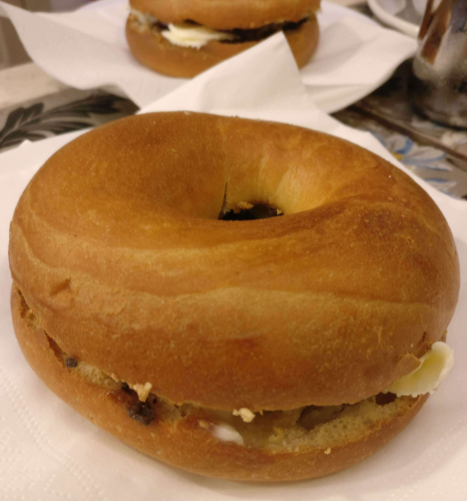
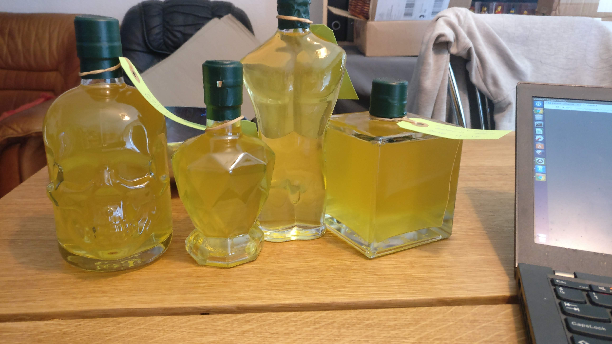

# Drinks
 
## Nissepis

* 1 flaske Ribena solbærsaft
* 1 fl.vodka
* 2 hele kanelstænger
* 2 skiver ingefær
* 5 hele nelliker.

Ribena saften simrer med krydderierne i 20 min. Koges ind til ca. det halve.

Står til næste dag hvor den sies, og tilsættes en fl.vodka. Kan drikkes med det samme, men bliver bedre ,hvis den får lov til at stå et par uger.

## Pet Shop Boys inspireret

fra the royal opeara house i anledning af psbs koncerter i juli 2024
med barens kommentarer.

### It's a sin
Cherry+vivir tequila + cbd highball

Combining some controversial ingredients to match with a song about guilt
and repression stemming from a strict religious upbringing.

### Go West
Blueberry & vanillia moscow mule wit east london liquor vodka

A fruity sweet take on a moscow mule from song themed on a soviet pursuit
of freedom, hope and a better life

### West end girls
Peach & almond mojito with east london liquor rum

Varying flavours combine in a song about the contrasts and challenges of urban life,
exploring themes of social class and existential angst in the city.

### What have I Done to Deserve this?
Burnt Faith English brandy, apple & caramel fizz

A soothing, comforting cocktail for a song about the emotional struggle and confusion
following a relationship breakup.

### Always on my mind
Basil & Di Capri Limoncello Tom Collins with Portobello gin.

Zingy and herby expression on a classic cocktail and modern classic song
about regret and longing for not showin enough appreciation to a loved one.

### Ingefærshots

Justeret fra Valdemarsro.

3 dl vand
50 g ingefær
2 stykker gurkemeje
1½ dl frisk citronsaft
1 brev kamillete
3 stængler frisk timian
4 spsk honning

Skræl rodfrugterne, og skær dem i tynde skiver. Hæld vandet over og bring i kog,
lad koge under låg i 20 minutter.

Tag gryden af varmen, tilsæt kamilleteen, timianen og citronsaften. Lad det trække
mens det køler af til stuetemperatur. Sigt, og rør honning i. Kommes på atamonskyllede 
flasker.

Opskriften sagde oprindeligt 2 dl citronsaft og 2 spsk honning. Jeg har tilføjet
gurkemejen. Det kan godt være man kan klare sig med 1 stk.

### Vermut

Det var åbenbart også noget min mor lavede. Eller min far. Den gang i 70'erne.

* 5 kapsler kardemomme
* 7 hele nelliker
* 2 stjerne anis
* 6 enebær
* ½ tsk korianderfrø
* ½ tsk malurt
* ½ tsk kamilleblomster
* 1/4 tsk friskkværnet muskatnød
* Skallen af en hel appelsin
* to strips citron skal
* 3 kanelstænger
* ½ vanillestang
* 1 flaske let hvidvin. Pinot grig.
* 2½ dl sukker
* 2½ dl sød sherry

knus kardemommen, nellikerne, anisen, enebærree og korianderen i en morter.

Skrap det i en gryde, tilsæt resten af krydderierne. Hold malurten i en lille
gazepose

hæld hvidvin over og bring i kog. tag den af varmen, og lad den trække i 24 timer.
Fjern posen med malurt efter 12 timer (det er et gæt, da den fik lov at være der
hele perioden synes jeg den smagte for meget igennem. Men den skal være der, det 
er et af de definerende træk ved vermut)

Lav en lys! karamel med sukker og 2 spsk vand. RØR IKKE I KARAMELLEN MENS DEN
SMELTER. Tilsæt sherry. Nok lidt mere end 2½ dl - for sidste forsøg endte med en
lidt for viskøs vermut. Opløs karamellen i sherryen.

Sigt vinen, tilsæt sirupen. Bum.

## Limoncello

En trøffelbagel.

Vi var i Firenze her i efteråret. For anden gang. Det var lidt fugtigt, og det er det åbenbart ofte om efteråret. Til gengæld er der ingen tvivl i mit sind - Firenze skal besøges i efteråret. Firenze ligger nemlig i norditalien. Det er trøffelland. Og efteråret er højsæson for hvide trøfler.

Det er min mand først fornylig blevet enig med mig i. Det har taget en del tid at få lært ham at spise trøfler.

Men det er slet ikke det der er anledningen her. Det er derimod en ting vi er enige om er godt. Nemlig limoncello. En italiensk citronlikør. Og den kan man lave selv.

Limoncello smager som en alkoholisk limonade. Den er farlig. For det smager som saftevand. Men det er det ikke, hverken det ene eller det andet.

Limoncello laves ikke ved at blande alkohol med en limonade. Den laves ved at lade citronskal trække i alkohol. Og derefter tilsætte sukkeret. Og hvordan gør man så?

Ingredienser:

8 økocitroner
1 flaske vodka
7 dl vand
450 gram sukker

Fremgangsmåde:

Vask og skræl citronerne. Undgå at få for meget af det hvide fra skallen med.
Smid skrællerne i et stort sylteglas, og hæld vodkaen på. Lad det trække i en uge.
Opløs sukkeret i vandet - det kræver at det kommer op at koge. Lad det koge i 15 minutter. Undgå at røre for meget, så du undgår at der er fast, uopløst sukker på kanterne. Lad sukkerlagen køle af.
Sigt citronskallen fra alkoholen, og bland sukkerlagen i.
Filtrer, hæld på skoldede flasker.
Lad likøren, for det er hvad den er, hvile i et par uger. Eller så længe du nu kan vente.
Server iskold.

Og her er resultatet. Flaskerne er fra Flaskelandet.dk
De bor godt nok i Tyskland, men deres hjemmeside er på 
dansk, og de er gode at handle med.

## Limoncello - version 2

Mit første forsøg med limoncello var aldeles glimrende. Men der var en enkelt kommentar. Det var ikke stærkt nok. Resultatet holdt vel i omegnen af 20% alkohol. Og den "rigtige" limoncello skal sådan set op på ca. 40%.

Det er ikke let! Man skal have fat på finsprit. Og med lidt held har svigerfamilien været over grænsen, og fundet et par flasker til mig. Ellers må de bestilles i Føtex.

Men opskriften jeg har i sinde at følge når de stærke varer er kommet i hus er som følger:

Skrællen af to økologiske, ikke-overfladebehandlede citroner.
To nelliker
ca. 10 cm kanel
50 ml finsprit

Samles i et glas, og opbevares lukket, og i mærke i 8-10 dage.

2½ dl vand
250 g sukker

Koges sammen, og køler af.

Essensen sies, og hældes sammen med sukkerlagen og 1½ dl finsprit.

Hep! Det giver kun lige under ½ liter. Men det må være nok til det første forsøg.

## Hjemmelavet gin

Når man laver sin egen tonic – så bør man vel også lave sin egen gin.

Gin er basalt set en kryddersnaps, hvor den primære smagsgiver er enebær. Det er sådan set definitionen på gin. Så det er jo ikke fordi det er svært.

Jeg er i den lykkelige situation, at jeg fik en Anova precision cooker i fødselsdagsgave sidste år. Og en af de opskrifter der er i den app der knytter an til den, er på sous vide gin.

Det er helt enkelt:
3 ounces (88 ml) vodka
10 korianderfrø
8 enebær
2 stk tørret lavendel
5 hele peberkorn
2 kardemommekapsler
1 laurbær

Det hele smides i en pose der sænkes i vand for at få luften ud, og forsegles. Lynlåsposer anbefales. Dernæst får posen 10 minutter i vandbadet ved 80 grader.

Nu havde jeg ikke korianderfrø i huset. Og det lavendel jeg har, er så findelt at jeg aldrig får siet det fra igen.

Så i stedet lavede jeg en tester:

Så skal der bare vodka i!
90 ml vodka
8 enebær
1 laurbærblad
2 kardemommekapsler
5 peberkorn

I stedet for at komme det i en lynlåspose, kom det i et sylteglas (160 ml)

I vandet – 80 grader – 10 minutter. Og så på køl, så jeg ikke skulle prøvesmage varm gin.

Der var ærligt talt ikke så mange nuancer i det – andet end peber, som overdøvede alt andet. Så det var rimeligt givet at der skulle skrues kraftigt ned for den.

Jeg havde annonceret dagens projekt på Facebook – og min lillebror, der også er kreativ i et køkken, kommenterede at han havde prøvet. Og at man med fordel kunne fordoble antallet af enebær. Så der blev lavet ti batches med varierende indhold. Basis i dem alle var:

1 laurbærblad
2 kardemommekapsler
16 enebær
3 peberkorn
90 ml vodka

Og så variationerne:

Batchnumre, og tilsætning:

1 allehåndebær
2 allehåndebær
1 nellike
2 nelliker
5 fennikelfrø
10 fennikelfrø
1 lille stjerneanis
1 stor stjerneanis
5 kommenfrø
10 kommenfrø.

Alt på glas, der lukkes og sættes på vandbadet. Et ret stort et af slagsen. Normalt bruger jeg min suppegryde til sousvidingen. Men jeg ville godt lave alle 10 glas på en gang. Jeg kunne selvfølgelig bare lave fem ad gangen. Krydderurterne skal jo filtreres fra, og det kunne jeg passende gøre mens de næste fem kom i gryden. Men bagefter havde jeg planlagt at glassene skulle i brug igen til næste uges morgenmad (man kan ane dele af det på panden i baggrunden). Og der skulle de være i vandet i en time. Og så ville det blive lidt for bøvlet. Så ned i kælderen og finde en termokasse – vi bruger dem når min vi holder fødselsdag for min mand, og hele svigerfamilien + min side er der. Og der derfor skal laves mad til 18 mennesker. Elkedlen op at koge, hælde kogende vand over låget – ja, den kan godt tåle 100 grader. Montere Anovaen, hælde vand i – hold da op hvor skulle der 
meget vand i. Så støbejernsgryden og et stort sylteglas kom med ned i kassen. Det endte med at se således ud. Det er strengt taget noget rod at sætte en støbejernsgryde i – den kræver ret meget energi at varme op. Der er jeg nok nødt til at finde en mere fiks løsning til næste gang.

Nå. 80 grader. 10 minutter. Alle glassene blev taget op, og indholdet filtreret over på andre glas. Og så var det sådan set bare at vente på at det var blevet så koldt, at man kunne prøvesmage. Jeg har ikke taget billeder af prøverne – de var stort set ens. Det der er pointen er egentlig, at det ligner urinprøver. Det er meget gult, og det kunne nok være interessant at teste hvor farven egentlig kommer fra. Jeg har – baseret på tidligere eksperimenter med pebersnaps – en fornemmelse af at det i ret høj grad er peberen der giver meget af farven.

Anyway. Hvordan smagte det?

Batch 1 og 2. Det var dem med allehånde. Den bliver ret kraftigt krydret. 2 allehåndebær er klart for meget. Og 1 enkelt er faktisk også i overkanten.

Nellikerne i batch 3 og 4. Nelliken er meget tydelig allerede med en enkelt nellike. Så batch nr. 4 smagte ikke overraskende alt for meget af nellike.

Så var der fenikel. Det smagte klart anderledes end de andre udgaver. 10 fennikelfrø er efter min mening ikke for meget.

Stjerneanis. Batch 7 og 8. Der skal helt klart stjerneanis i den endelige opskrift. Men ikke en hel. Den lille smagte af lidt for meget – det skal være gin, ikke ouzo. Så i hvert fald ikke en hel stor stjerneanis.

Kommen. Nixen bixen. Der var ikke meget stor forskel på batch 9 og 10. Men der skal nok ikke kommen i overhovedet.

Samtlige batches, det der var tilbage efter jeg havde prøvesmagt – blev hældt sammen. Der er stadig lidt over halvdelen tilbage. I virkeligheden er jeg mere til rødvin end gin.

Næste forsøg? Ja, jeg skal have lidt styr på hvor farven kommer fra. Jeg tror meget af det kommer fra peberen. Og når jeg egentlig ikke er så meget til peber, så kan det jo være lige meget.

Så skal jeg have styr på kvantificeringen af stjerneanisen. Det er ikke specielt præcist at angive “lille stjerneanis”. Jeg skal have fundet ud af hvordan jeg får skruet ned for nelliken. og allehånden. Og så skal det naturligvis overvejes hvilke andre smagsgivere jeg kan komme i.

