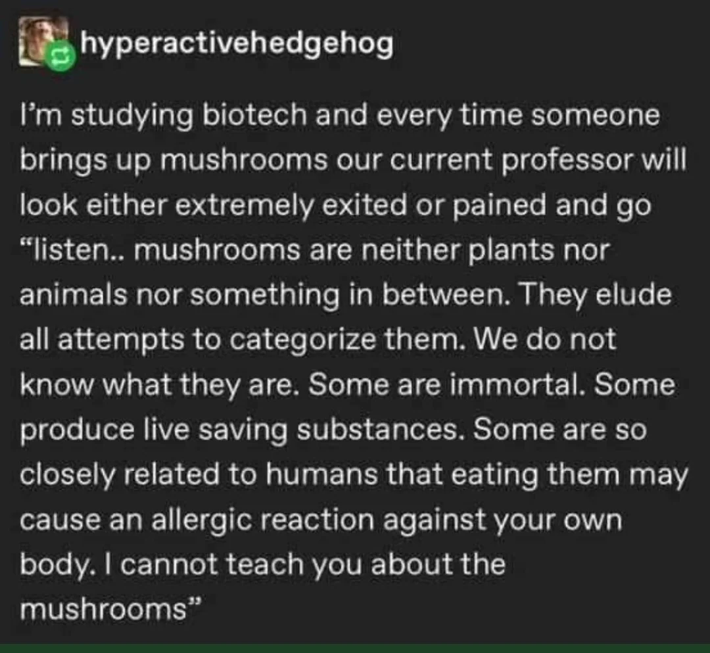

# Lidt mere teoretisk

## Svampe

Noget af det magiske ved svampe er deres indhold af frie aminosyrer. Især
glutaminsyre. Når den nedbrydes under tilberedningen, får vi på helt naturlig
vis mononatriumglutamat, eller det utroligt farlige MSG som veganere og andre
med forkærlighed for svampe er meget bange for. Nej, jeg forstår heller ikke
logikken.

Anyway, MSG fra svampe er koncentreret umami, særlig mundfylde - og så forstærker
det ca. alle andre smage.

Det viser sig i forskningen at glutamats smag mere end fordobles, hvis det kombineres
med visse nukleinsyrer - og netop tørrede svampe har en høj koncentration af
nukleinsyren guanylat. Og så er der fuld skrue på umamismagen.

Svampe er ikke grøntsager:

Men de har især særligt stærke cellevægge. De indeholder kitin, der ikke er
vandopløseligt, i modsætning til planters cellevægge, der bruger pektin i samme
rolle.

Det betyder at svampene bevarer (mere) af deres struktur ved tilberedning. Det
er endnu en af årsagerne til at de minder en del om kød i både smag og tekstur.

Store dele af forskellene mellem de forskellige spisesvampe er knyttet til duftstofferne.
Octenol giver noter af skovbund, men noterne spænder fra mandler til skaldyr.

For de fleste svampe gælder det at deres aromastoffer intensiveres når de tørres.

En frisk svamp indeholder ca 80% vand. Det skal reduceres ved tilberedningen, og
 det gøres bedst ved moderat varme i længere tid, gerne tørstegning, så vandet
 fordamper letere. Når vandet er delvist fordampet, har vi fået aktiveret
 aminosyrer, nukleinsyrer og aromastoffer kemisk. Og så skruer vi op for varmen.
 Det er her vi tilsætter fedtstof - af god smag og kvalitet, da svampene optager
 det og tager smag af det.
 
Møre svampe giver generet mest smag og duft. Bortset fra trøfler. Den hvide dufter
mest, den sorte sommertrøffel er kraftigst i smagen.

De mørkere svampe der i tørret udgave giver mest umami, er Karl Johan, morkler,
shitake og matsutake. Og eftersom friske stegte svampe optager smagen af det
de bliver stegt med, kan man få helt almindelige champignoner til at smage af
meget mere, hvis man steger dem med udblødte tørrede karljohaner.

Det er duftstofferne der bidrager mest - og derfor handler det om at fastholde
dem så godt som muligt. Mange af duftstofferne kan kun registreres gennem næsen,
men ikke ad mundhulen når vi tygger svampen. Derfor kan trøfler virke skuffende,
hvsi vi ikke binder nogen af de flygtige stoffer i fedt.

Da trøfler ikke særligt godt tåler varme, gøres det bedst i form af spejlæg eller
pasta med smør - som vi så høvler trøfler over i stedet for at give dem varme.

De fleste andre svampe har helt generelt bedst af at blive varmebehandlet og
få et skud godt fedst for at fastholde duftstofferne. Det gælder både morkler,
men også kantareller.

Så - kombiner de sjældnere vilde svampe, med de mildere dyrkede svampe,
der tager smag af de vilde - og giver fylde og struktur i retten.