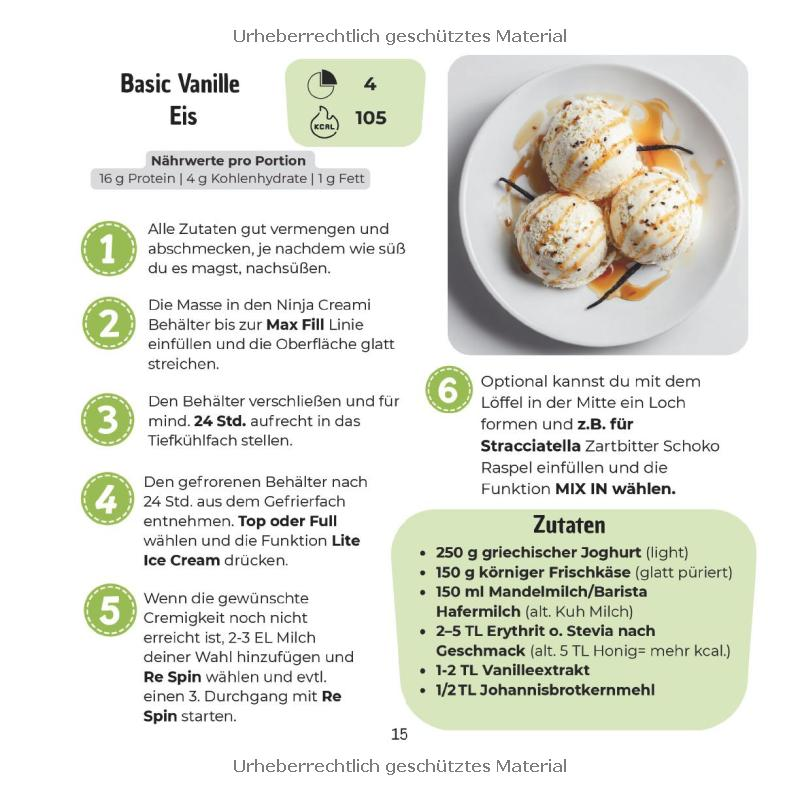
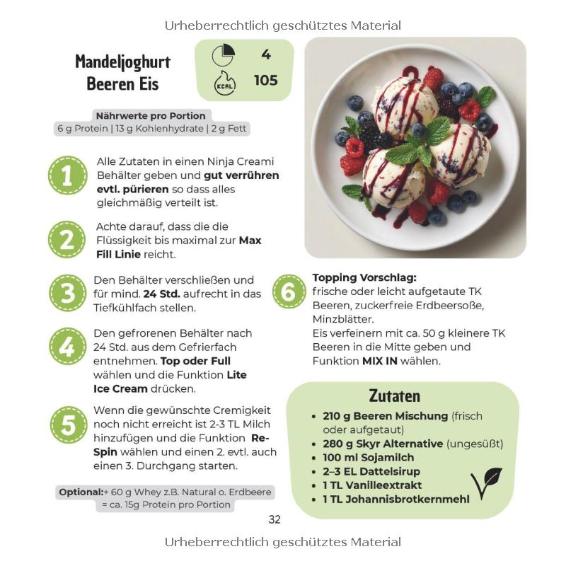

# ting der skal testes

## Basic vanille is 
Fra en ninja kogebog.

250 gram græsk youghurt
150 gram "Körniger" flødeost - glatt puriert
150 gram mandelmælk. eller almindelig komælk
2-5 TL (mon ikke det er teskeer) erythrit eller stevia. Eller 5 TL honning
1-2 tl vanilleekstrakt
½ TL johannesbrødkernemel

Alle ingredienser blnades godt og smages til. Og så siger opskriften at det skal i en ninja creami beholder, og sættes i fryser i mindst 24 timer. Og så skal man vælge "lite ice cream" på den fine maskine.
Der lægges op til at makn kan komme 2-4 EL mælk i undervejs hvis ikke det bliver tilpas cremet.

## Mandeljoghurt beere eis

