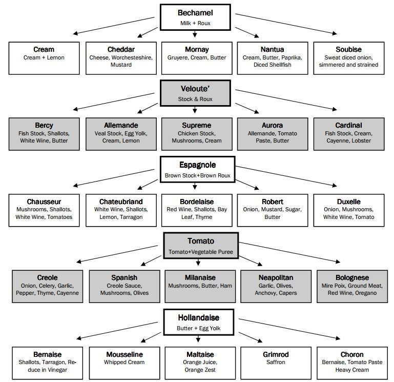
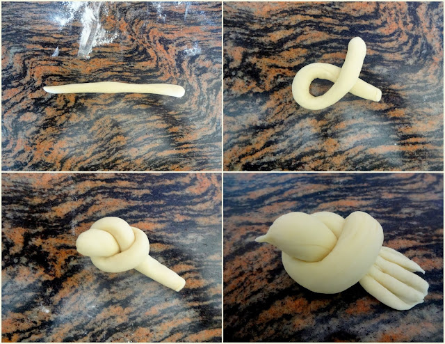

--- 
title: "Nusses kogebog"
author: "Christian Knudsen"
date: "`r Sys.Date()`"
site: bookdown::bookdown_site
# output: bookdown::gitbook
documentclass: book
bibliography: [book.bib, packages.bib]
biblio-style: apalike
link-citations: yes
github-repo: openscapes/series
description: "Nusses samling af opskrifter og sådan"
---

# Welcome {#welcome}

Hej. Dette er det køkken jeg drømmer om. Indtil da:
Dette er min kogebog. Nusses samling af opskrifter - dimensioneret efter os to derhjemme.

`r knitr::include_graphics("images/DALL·E-dieselpunk.png")`

<!--chapter:end:index.Rmd-->

# Gris

<!--chapter:end:rmds/gris.Rmd-->

# Vildt

## Kanin

### Forloren gedegryde.

Nej, der er ikke ged i. Men når de rer improviseret i køkkenet, er spørgsmålet
ofte: "Hvad hedder det?". Det aner jeg ikke, jeg har jo improviseret. 
Modspørgsmålet er derfor: "Hvad har du lyst til at kalde det?".

Svaret denne gang var "Forloren gedegryde". Og det er jo rigtig nok. Der er ikke
ægte ged i.

½ kanin
1 spsk sennepspulver
1 finthakket løg
4 finthakkede hvidløg
1 æble (skrællet og i mindre stykker)
½ rulle gedeost
2½ dl piskefløde
½ liter kyllingefond/mælk
Lidt sherry
Smør og mel
Salt, peber

Kaninen gnubbes med salt, peber og en spsk sennepspulver, og hygger sig i køleskabet en 5-6 timer. Kaninus brunes i stegegryden, og tages op. Løgene klares, og hvidløg og æble tilsættes, og får lidt varme. Gryden koges af med en sjat sherry, og fløde, kyllingefond og/eller mælk tilsættes. Jeg gav den 2½ dl fløde, der var ikke så meget kyllingefond tilbage i skabet, så der blev suppleret op med skummetmælk, til det passede. En ½ rulle gedeost var til overs fra produktionen af nytårssnacks. Den blev skrællet og dumpet i sovsen også. Kog sovsen igennem til æblerne er gået i opløsning.

Lad Ninka Ninus vende tilbage til gryden, og lad det simre i ca. 20 minutter. Sovsen jævnes med en melbolle, og smag til med salt, peber og lidt mere sennepspulver.

Jeg serverede den med ris og ærter. Og der blev spist op.

<!--chapter:end:rmds/vildt.Rmd-->

# Lam

## LAMMEKØLLE

Vi spiser ikke meget lam. Men til påske skal det være. Opskriften er oprindeligt fundet i Weekendavisen, men justeret undervejs – så jeg kan dårligt huske hvordan den oprindeligt var.

1 udbenet lammekølle

200 g gedeost

3 fed hvidløg

2 kviste rosmarin

20 tørrede abrikoser

Kartofler – et par kilo

En halv liter grøntsagsbouillon

Salt og peber

Rosmarin – hakket, hvidløg – hakkede og abrikoserne – hakkede, blandes med osten. Lammekøllen stoppes med mixet. Der er ikke plads til det hele – no worries.

Køllen snøres med bomuldstråd.

Kartoflerne skrælles eller skrubbes, skæres i både og fordeles i en bradepande. Resten af oste-blandingen fordeles blandt dem. Køllen placeres på en rist over kartoflerne, og hele herligheden får ca. 1½ time i ovnen ved 175 grader. Kernetemperaturen (i kødet – ikke i fyldet!) skal lande på ca. 60 grader. Rør gerne rundt i kartoflerne undervejs.

Bønner eller bønnesalat går godt hertil – det knækker lige den fede smag fra lammet og osten.

<!--chapter:end:rmds/lam.Rmd-->

# Retter med kylling

## Kyllingetærte

1 kylling
2 løg
5 fed hvidløg
3 porrer (to rækker)
4 gulerødder
4 stilke bladselleri, som vi udelader fordi Kristian ikke er fan af selleri.
1 pastinak eller persillerod. Stor.
1/4 kg champignons.
evt en håndfuld tørrede svampe. Ikke morkler eller den slags. Karl johan eksempelvis.
timian
laurbærblade 4 stk
½ liter kraftig hønsefond
2 spsk mel - toppet
1 glas hvidvin (2½ dl)
2 dl fløde
smør
olivenolie
butterdej

Fjern rygbenet fra kyllingen med en fjerkræsaks. skær brystbenet frit og ud.
krydr med salt og peber invendigt, og læg dyret på en rist med kødsiden opad.
Smør olivenolie på skindet og drys med sat. Bag den i ovnen ved 200 grad i 
45 minutter. Det går fint i en airfryer.
Ryg og brystben simrer i onden under låg i en halv times tid så vi får den 
smag med. Fisk ben op og tilsæt de tørrede svampe til fonden. Lad dem trække
en 20 minutters tid.
Hak løg - ikke for fint. Hak hvidløg - noget finere. Skær rodfrugterne, porrene
og sellerien (hvis du tager den med) i mundrette stykker. Rens svampene og 
halver eller kvart dem. 
Olie og smør i en stegegryde - når det er bruset af, først løg, lidt senere
hvidløg, og steg til de falder sammen, de skal ikke være helt karameliserede.
grøntsager og svampe tilsættes, sammen med timian og laurbærbladene. Steg det hele
til de tager en smule farve og rodfrugterner er en smule møre. Drys mel over
og bag af. Tilsæt fond og hvidvin lidt af gangen og kog til det tykner.
Tilsæt fløde og lad det simre yderligere et par minutter. Der kan jævnes lidt
mere med maizena. Det skal være ret tykt.

Når dyret er færdig i ovnen tages det ud og køler nok af til at man kan arbejde
med det. Evt. sprødt skind tages af og skæres i små stykker.
Al snask fra bradepanden skrabes over i gryden. 
Pil kødet fra dyret, og sær i mindre tern. Kom det i stuvningen og smag til med
salt og peber. Fisk laurbærblade og timianstilke (hvis du brugte frisk timian)
op. Smid også kyllingeskindet i.

Kom stuvningen i dyb tærteform eller lignede og lad det køle af.
Rul butterdej ud (hvis ikke den kommmer i plade). Pensl kanten på formen med æg
og læg butterdej på som låg. Pensl låget med æg, og skær et snit i midten af 
låget, så damp kan slippe ud. Bag i ca 35 minutter ved 200 grader. Lad 
den hvile ti minutter inden servering.

## Hverdagskylling med kremede svampe

Fra food52

* ½ kg svampe
* 4 spsk smør
* ½ kg kyllingebryster - Oprindeligt var det 1 kg
* 2½ dl piskefløde (eller madlavningsfløde)
* 2 spsk dijon sennep
* finthakket purløg

Rens svampene, skær halvdelen i skiver, og resten i kvarter.

* Smelt 2 spsk smør, 
* tilføj svampene, steg dem 10-15 minutter, til
de begynder at karamelisere. 
* Halver kyllingebrysterne på langs,
og bank dem med kødhammeren, ca 1/4 tomme så - 40 millimeter?
* dub dem af, og krydr med salt og peber.
* Giv svampene lidt salt og peber, deglacer med 1/3 cup vand.
* Smelt resten af smørret, steg kyllingerne. Smid gerne en 
bøfpresse ovenpå dem.
* Bland fløde og sennep. Rør dem i svampene, og kog under omrøring
til den tykner. Smag til med salt, peber og sennep.
* Saml - kylling overhældes med svamep. Vi serverer med ris.

# onepot chicken & rice
Fra noma

* 60 g olie
* 4 kyllige lår uden ben, med skin
salt
140 gram løg finthakket
3 fed hvidløg smadret
15 g tomatpasta
60 g hvid miso
15 g røget paprika

80 g røget svampe garum
600 g grøntsagsbouillon

10 g salt
200 g ris
10 g persille
200 g mayonaise
1 fed hvidløg - revet.

sautepande - olie varmes op unmder middel varme. krydr kyllingerne med generøse mængder 
salt. Når olien simrer, brunes kyllingen. til den er mørkebrun og sprød. ca. 4 minutter.
fjern kyllingerne fra panden. Skru ned til lav varme.
tilsæt løg og hvidløg. Steg til løgene er klare.
rør tomatpastaen i og steg ca. 5 minutter til tingene er rustent brune.
Tlilsæt bouillon, stalt, røget svampe garum, parpirka og miso. Øg temperatren til høj. Rør for at 
blande.

Når væsken koger, tilsæt risene og rør så de er jævnt fordelt. Her fra skal risene ikke røres!

Skru ned for varmen, og lad den simre. tilføj kyllingerne til gryden, med den rå side ned. (så ved stegningen
er det kun på skindsiden at den skal steges!) Når duften af brændte ris kan mærkes - efter ca. 20-25 minutter
er vi ca. færdige. tag af varmen, og lad hivle i 5 minutter. pynt med hakket persille.

Bland mayo med hvidløg og bland godt. 

Server portioner af ris på tallerken - husk at få det sprøde let brændte lag med. Kylling på toppen.
Top yderligere med hvidløgsmayo.

## pollo orzo
One pot. Og relativt hurtig.

Orzo er de der små rislignende pastating. 

* Kyllingestykker. Helst med ben. En samling lår er fint.
* 3 fed hvidløg
* 2 tsk salt
* peber
* 1½ liter vand
* ~½ liter kyllingefond.
* En dåse hakkede tomater
* 1 løg eller to hvis det er et lille løg
* 340 gram orzo pasta
* persille

Brun killingerne i olie/smør/andefedt/margarine
ca. 5 minutter på hver side.

Tag killingerne op, og brun pastaen let i fedtstoffet.

Tilsæt finthakket løg og klar løgene. Smid finthakket hvidløg i til sidst.

Læg killingerne tilbage i panden.

Hæld fond og tomater over.

Låg på, og lad simre 10-15 minutter, afhængig af orzo type og killing.
Pastaen skal være al dente, killingen skal være gennemstegt/kogt.

Tag gryden af varmen, og lad den hvile i 5 minutter. Orzoen skal gerne absorbere
stort set al væden. Hvis det skal være ekstra festligt, så hæld persille over.

<!--chapter:end:rmds/kylling.Rmd-->

# Preservationerne

## Æblesmør
* 2487 gram æbler, skrællet, og kernehus fjernet
* 1,2 l vand
* 3 stjerneanis
* vanillestang - eller vanillesukker
* 3 kanelstænger

Koges til mos.

Mosen paseres gennem sigte - vi skal af med stjerneanisen. 
Det er hård arbejde, så sæt god tid af.

Mosen over i en ren gryde/sauterpande eller lignende.
Kog sammen vanillestangen (eller sukkeret), samt kanelstængerne.
Simrer roligt under låg 1½ til 2 timer, til det bliver mørkt og tykt.

<!--chapter:end:rmds/marmeladerne.Rmd-->

# Pasta

## Misopasta

* 310 gram  pasta - linguine eller bucatini
* 6 spsk smør
* 3 spsk miso (sådan en vejer 18 gram)
* 100 gram revet parmasan

Bring vand i kog, og kog pastaen.

Imens samler vi smør og miso i en gryde eller lignende - jeg
bruger min sauterpande. Der røres ret grundigt rundt.
Tilsæt den næsten færdige pasta og 2½ dl eller så kogevand
fra pastaen. Samt parmasanen. Rør aggresivt, indtil 
osten er smeltet og sovsen danner en emulsion.

Bum. Server evt noget kylling i skiver, en grøntsag eller noget.

## Mac n Peas

* 600 g frostærter
* 310 g makaroni
* 50 g smør
* 3 fed hvidløg
* 60 g parmasan

Kog ærter og makeroni
Hak hvidløg fint, og lun i smørret på sauterpanden
Overfør de fleste af ærterne til panden, og stavblend sammen med parmasanen (og salt og peber)
De resterende hele ærter, evt også lidt kogevand, samt makeroni røres sammen med ærtemosen i panden.

Server et par af Faktas (nu 365s) flutes til.

## Pasta al Dante

Dante skrev i følge overleveringen sine digte på en plads med udsigtover byggepladsen hvor Duomoen blev bygget. I følge rygterne havde han en overmenneskelig hukommelse.
En forbipasserende skulle have spurgt ham hvad der var bedst at spise. Og han svarede prompte "æg". Den samme forbipasserende fandt hm et år senere siddende samme sted, og spurgte "Med hvad". Hvortil Dante skulle have svaret, lige så prompte - "Med salt".

ingredienser
* 300 g bucatini
* 2 af faktas flutes
* 3 fed hvidløg
* Æg
* lidt chiliflager

## Italiensk pølsebix

## Standard pastabix

## Onepot Pasta

## Putanesca

også kendt som Luderpasta
Ingredienser
* 200 g sorte oliven
* 2 spsk kapers
* 4-5 rensede ansjoser
* 3 fed hvidløg
* 1-2 peperocini
*1 dåse flåede tomater
* 1 spsk revet citronskal
* 1 håndfuld persille
* 1 smule olivenolie
* 320 gram spaghetti

Hak det hele fint, hver for sig.

olien varmes op på panden, og hvidløg og peperocini svitses. Hvidløget må ikke blive brunt. Og peberen er en smagssag.

Tilsæt oliven, kapers og ansjoser. Steg lidt under omrøring

flåede tomater tilsættes.

Lad det simre mens pastaen koges.

Smag sovsen til med slat og peber, lidt sukker og hakket persille samt citronskal.

Bland pastaen i. juster evt. tykkelsen af sovsen med pastavandet.

## Aglio et olio

Ingredienser

400 g bucatini er passende. Prøv med 410 gram næste gang.
 4 fed hvidløg, finthakket
 4 spsk god olivenolie
 parmasan - 53 gram er for lidt
 hakket persille - en håndfuld.
 Chili - nok bedre med en peperonici eller hvad den nu hedder En enkelt tørret chili er passende

hak chili og hvidløg, og lun i olien i sauterpanden. Det går hurtigt, så det kan godt vente til pastaen er i vandet.

Kog pastaen til den er al dente,
vend pastaen i olien og rør sammen med parmasan og persille

2 af faktas flutes ting til.

## one pot lasagne

Anekdoten
Vi så store mængder youtubevideoer. Med en eller anden der ikke hedder babish, men kalder sig det alligevel.

Ricottaen er pillet ud. 2 klodser moz er fint. En karton pizzasovs, og en enkelt dåse hakket tomat er også nok.
400 gram hakket ko.
Og så kom jeg i første omgang noget der minder om 15 lasagneplader i - og det var i overkanten.
https://basicswithbabish.co/basicsepisodes/onepot-pasta

originalen:
10 lasagneplader
1 spsk oliven olie
½ kg spicy italiensk pølse. Men vi bruger hakket kød
½ stort løg
2 fed hvidløg
1 tsk røde peber flager
28 oz knuste san marzano tomater. på dåse
½ cupå varmt vand
8 oz tomatsovs
8 oz mozarella
basilikum. Og sådan

https://basicswithbabish.co/basicsepisodes/onepot-pasta

## pasta med broccoli
* 400 gram pasta
* 1 stor buket broccoli - eller 2 små, det er sådan de kommer i mit supermarked.
* 5 hvidløg
* 7 ansjosfilleter (i olie)
* Chili/peperoncini eller lign. et mellemstort nip
* olie
* peber
* Revet parmasam

Skær broccoli i små buketter, skræl og skær stokken ud i mindre stykker.

Kog broccolien i let saltet vand - til den stadig er relativt fast. Si vandet fra broccolien.

Sæt pastaen over. 10 gram salt per liter vand.

Hak hvidløg og ansjoser, og steg hvidløgene i olivenolie i en sasuterpande sammen med chilien i et par minutter. Tilsæt ansjoserne, og steg videre til fisken er smeltet. Giv det evt lidt pastavand hvis det bliver tørt.

Smid broccolien i panden, og steg dem med.

Det skal først ske når pastaen er næsten færdig, ellers bliver broccolien let for smattet.

Smid den al dente pasta i panden, bland, og tilsæt parmasan, smag til med peber og juster med pastavand.

<!--chapter:end:rmds/pasta.Rmd-->

# Ko

Ko-opskrifter.

<!--chapter:end:rmds/ko.Rmd-->

# Sovsene

Den skal laves til noget egen grafik.

## bærnæse

## De andre sovse

### steaksovs:

1/4	cup sennepspulver, Colmans - det er så også den eneste jeg normal kan finde
2	spsk varmt vand
2	spsk risvins eddike - vi prøver nok også med hvidvinseddike
1/4	cup soyasovs

Bland sennepspulver med vandet, og lad det sætte sig et par minutter.

Tilsæt eddike og soyasovs, bland, og passer gennem finmasket si.

Bum. Den skulle blive bedre hvis den får lov at stå på køl mindst en time.

Går også godt med andet - eg fisk.

### cherry tomat sovs

Fra Noma. Hvor de kalder den for "Faster than you can boil pasta cherry tomato sauce"

* 30 ml oliven olie
* 2 fed hvidløg
* 200 gram søde cherry tomater
* 1½ spsk "wild rose vinegar". 

Skær hvidløgene tyndt, tilføj dem til kold pande, med olivenolien.
Medium varme til de begynder at karamelisere.
Tilsæt de hele tomater, med et generøst drys salt. Låg på.

5-6 minutter senere er tomaterne sprængt og meget bløde. Stavblend til du kan lide konsistensen. Tilføj 
eddike (mon ikke vi skal prøve med balsamico), og smag til med mere eddike, salt og peber.

Foldes ind i kogt pasta, og serveres med et drys parmasan ost, et par dråber olie og evt et frisk basilikumblad.

Serveres med 200-300 gram pasta (altså før det koges)

### Pebersovs

Der skal udvikles yderligere. 
Den foreskrev oprindeligt 50 gram peberkorn. Og det var for meget.

2 små skaloteløg
olivenolie
25 gram syltede grønne peberkorn
2 teskeer sennep
7 dl okseboullion
1 sjat whiskey (prøv evt cognac i tstedet)
1 dl fløde
100 gram smør

skalotteløg hakkes og klares i olie.
Peberkorn (knus ca 1/4 af dem med en ske) skylles og tilsættes
sammen med boullion og sennep. Koges ind til ca. det halve.

tilsæt whiskey og fløde - kog et minuts tid ekstra.

Monter med smør, smag til med salt, sukker og peber.

Med 50 gram peberkorn, hvor intet blev mast, skulle der 
2 dl fløde til, og den var stadig ret heftig.

### Røget svampesauce

* 400 g blandede svampe - skåret i relativt tykke skiver (ca 5 mm)
*olie
* 2 smadrede fed hvidløg
* 30 g smør
* 45 gram røget svampe garum
* 200 gram fløde
* 5 gram fint hakkede purløg
* 5 gram hakket persille
* salt, peber og citronsaft

brun svampene i olien i sauterpande ved middel varme.

tilsæt smør til panden. tilføj hvidløg. rør godt rundt til smørret er smeltet og alt er godt
blandet. ca. 2 minutter.

Steg svampene et par minutter til. Hæld garum i, og steg lidt videre, til 
væsken er optaget af svampene. ca. 3 minutter.
tilsæt fløde og lad simre til fløden er reduceret til halvdelen og blevet tykkere.
Tilsæt krydderuerter og smag til med salt, peber og citron.

Også brugbar som pastasovs.

## Bistro sovs

Her er vi i de ægte sovse. En opskrift fra Brødrene

* 1 1/4 dl hvidvin
* 4 æggeblommer
* 1 pakke smør
* 1 lille skalotteløg - hakket
* 1 bundt purløg - klippet
* 1 øko citron
* 1 tsk Sennep
* 1-2 spsk vineddike. Gerne sherry

Eddike, hvidvin og løg koges ind til stort set intet. 
Æggeblommer og sennep piskes sammen med essensen. Så piskes det klarede,
lune, smør i ganske som en bærnæse. Smag til med citron, salt og peber. 
Principielt bør det nok være hvid peber... Men det er vi for dovne til.
Evt også lidt mere eddike.
Rør purløg i, og server.

## Portvinssauce

* 1 gulerod
* 1 løg
* 1 fed hvidløg
* frisk timian
* 1 spsk olie
* 2 dl portvin
* 2 dl rødvin
* 4 dl oksefond
* ½ dl stegesky eller hvad du nu har fra resten af madfremstillingen
* salt, pber, citronsaft og gastrik
* 20 gram koldt smør i tern

rengør og hak grøntsagerne.
Sauter dem i olien.
Tilsæt portvin, rødvin og hakket frisk timian. Kog ind til det halve.
Hæld oksefonden ved, og kog igen ind til det halve. Tilsæt stegeskyen.
Smag til med salt, peber, citronsaft og gastrik.
Tag sovsen af varmen, sigt den og pisk smørtern i (et ad gangen). Server.

### Balsamico sovs

* 2 spsk rørsukker
* 2 spsk balsamico eddike
* 1½ dl kalve eller kyllingefond
* 2½ dl piskefløde
* Salt, peber, lidt maizenajævner

Smelt sukkeret, rør eddiken i. Rør fonden i til sukkeret er opløst. Rør piskefløden i, kog igennem. Juster tykkelsen med lidt maizena, og smag til med salt og peber.

<!--chapter:end:rmds/sovsene.Rmd-->

# kondimenterne 

## Syltede champignon
* 500 gram hvide champignons, rensede og rodskårne
* 2 dl mørk balsamico
* 2 dl olivenolie
* 1 spsk salt
* 20 sorte peberkorn
* 5-8 laurbærblade

Rør alt andet end svampene sammen - grundigt
Læg svampe i sterilt glas, hæld lage over, og lad trække i 
to døgn. Spises som tilbehør til grillet kød, som tapas elleer
i salater

## Trykkogerketchup

efter www.hippressurecooking.com/pressure-cooker-ketchup-recipe
og Dansk Kemi 2020 (6) p. 38 - 39, ved Jens Folke

1 kg blommetomater skåret i kvarte
15 g paprika
5 g salt
1 g stødt kanel
1 g nelliker stødt
2 g hvidløgspulver
2 g sellerifrø
10 g dijonsennep
15 g honning
80 g  rosiner
1/4 zittauerløg
85 ml æbleeddikke
15 g majsstivelse rørt ud i 15 ml vand

Kan yderligere krydres med chili, røget paprika, æble, korianderfrø
m.m.m

Smid alt undtagen majsstivelse og vand i trykkogeren.

Mos tomaterne nok til at væsken når op på trykkogerens minimumsbehov
bring trykkogeren under tryk, når den når 2 atmosfærer, lad koge i
5 minutter
Tag trykket af, og lad det koge ind i 10 minutter - reduceres til knap
halvdelen.

bland majsstivelse i vand, og hæld det i.
Smadr blandingen med stavblender - passer gennem sigte. 
 
## skalottemarmelade
Ikke en sovs - skal flyttes

giver 1½ kop
Neutral olie
2 pund skalotter - pillet og hakket
3/4 teske salt
½ kop sukker
6 spiseskeer malteddike - eller anden eddike.

Olie i sauterpande. 
løg og salt i pande.
"kog" under låg i ca. ti minutter. Rør undervejs, til løgene er klare
skru ned for varmen og tag låget af.
tilsæt sukker og 1 spsk vand. simrer i 30 minutter. deglacer med 1 spsk vand efter behov.
rør derefter fire spsk eddike i. simrer videre i 10-15 minutter, til konsistensen er jammy.
rør den resterende eddike ind, og sluk for varmen.
Smag til.
Hæld på glas (skoldet etc)

<!--chapter:end:rmds/kondimenterne.Rmd-->

# Specialiteterne

## Konfiterede hvidløg

Et lille sylteglas fyldes med pillede hvidløg

Salt kommes i (hvor meget?) sammen med krydderier.

rosmarin og rosenpeber skulle være godt.

Så fyldes glasset med en god olie og låget lukkes til.

Sous vides det i 3-4 timer på 87 grader

## Saltede æggeblommer

Fyld et par centimeter fint (IKKE groft) salt i en bøtte.
Skil blommer fra æg, og placer dem på saltet. Dæk fuldsændigt med salt
Lad stå i køleskabet 8 timer. 
Pil æggeblommerne op af saltet, skyl dem i koldt vand, tør dem. Og 
tør dem i ovnen vad 60 grader - 2 timer er for lidt, opskriften sagde også 3.
De er for gummiagtige, så de skal have længere end det.

Målet er at de skal kunne rives. Så de skal være ret hårde og tørre.

<!--chapter:end:rmds/specialiteterne.Rmd-->

# Rester

Måder at komme af med rester.

## Standard pastabix

## bixemad

## gratin

Men det er basisopskriften. Den skal bruges til at skaffe os af med rester.

100 g smør
150 g mel
3 dl grøntsagsbouillon
3 dl sødmælk
8 æg
salt, peber, rasp

mindst 50 gram rester, men den kan sagtens trække en del mere.
Skær resterne i mindre stykker

Smelt smør, rør sammen med mel. Lav grundlæggende en opbagt
sovs med væsken.
Del æggene, tag gryden af varmen, og rør blommerne i,.

Pisk hviderne stive, vend halvdelen i gryden sammen med fyldet.

Vend resten af hviderne i. Smør et fad/skål 
og drys med rasp. drys rasp over gratinen, bag nederst i ovnen
ved 175 grader i ca. 1 time. Server med smeltet smør.

<!--chapter:end:rmds/rester.Rmd-->

# Desserterne

## Æbletrifli

Måske man skulle skrive noget her?

<!--chapter:end:rmds/desserterne.Rmd-->

# Diverse og usorteret

Svampe og safran risotto

25 gram røget svampe garum - eller svampe bouillon
200 gram svampe - skåret i skiver
15 gram olivenolie
15 gram smør
1 lille løg
120 gram arborio ris
10-15 tråde saffran
600 ml vand
2 håndfulde revet parmasanost

Karameliser svampene i olie.
Tilsæt smør og 5 gram garum.

Klar løg i olie
Tilføj ris, lad dem blive dækket i olie og giv dem lidt varme.

Bland resten af garumen og vandet, hæld 400 ml over risene, og 
tilsæt også safronen.

rør konstant til væsken er absorberet. Tilføj resten af 
væsken, undervejs - til risen er færidg.

Rør en håndfuld parmasan i - tilføj lidt mere væske, og 
resten af osten. Smag til og juster konsistens med væsken.

Tag af varmen, rør svampene i, giv den lidt persille eller lignende
grønt på toppen, og server. 

## fuglebrød
Almindelig brøddej. Og så formet på denne måde:

Gerne en lille rosin eller korender som øje. 

## rå overleafnoter
### stammpot

et par kilo kartofler

et bundt grønkål. Hvilket nok er i overkanten.

fjern de grove ribber.

Hak et par løg og snit et par hvidløg fint.

damp kålen med løg og hvidløg - og hvidvin og smør

Skær kålen i strimler

Kog kartoflerne til mos - det anbefales at smide et par laurbærblade i.

Lav mosen - smør og mælk!

rør mosen sammen med kålen.

Server med skiveskårne, gerne røgede, pølser.

## den faste madplansrotation

## chachouka

5 peberfrugter (men det afhænger selvfølgelig af størrelsen) er passende.
6 æg er fint.
løg
spidskommen
paprika (lad nu være med at komme det i fra starten)
safran
en dåse hakkede tomater
salt og peber
Hvidløg

## brændende kærlighed
## kylling i karry

## Risengrød

## Hummus

En dåse kikærter (vægt drænet?)
En toppet spiseskefuld tahin
Citronsaft
1 tsk spidskommen
½ dl koldt vand
en isterning
3 spsk olie
salt og peber

## Dahl
210 gram røde linser
2 spsk revet ingefær
4 finthakkede hvidløg
3 tsk karry (medium stærk)
1 spsk spidskommen
0,50 spsk stødt koriander
0,50 tsk stødt kardemomme
0,50 tsk chiliflager
6 dl grøntsagsbouillon
200 g røde linser
2 dåser hakkede tomater
2 spsk olivenolie

## Risotto

4 dl risotto ris

## gratin

Men det er basisopskriften. Den skal bruges til at skaffe os af med rester.

100 g smør
150 g mel
3 dl grøntsagsbouillon
3 dl sødmælk
8 æg
salt, peber, rasp

mindst 50 gram rester, men den kan sagtens trække en del mere.
Skær resterne i mindre stykker

Smelt smør, rør sammen med mel. Lav grundlæggende en opbagt
sovs med væsken.
Del æggene, tag gryden af varmen, og rør blommerne i,.

Pisk hviderne stive, vend halvdelen i gryden sammen med fyldet.

Vend resten af hviderne i. Smør et fad/skål 
og drys med rasp. drys rasp over gratinen, bag nederst i ovnen
ved 175 grader i ca. 1 time. Server med smeltet smør.

## Tabbouleh

2 dl bulgur
20 cherrytomater
1 bundt mynte
1 bundt persille
1 stk rødløg
2 stk grønkålsstilke
1 citron
1 dl olivenolie
4 løg
2 spsk chiliolie eller tabasko. Det er nok lidt voldsomt..
200 gram græsk youghurt
2 tsk spidskommen stødt

2 dl bulgur koges i 4 dl vand. Når vandet koger, hældes bulguren i. Simrer i 2 minutter under låg

sluk for varmen, lad det trække 10 minutter. sig vand fra.
hæld bulguren ud på et fad eller lignende - så kornene kan blive skilt ad.

Hak tomater, mynte persille, rødløg, grønkål så fint som du gider. Bland det i bulguren på fadet.
Tilsæt revet citronskal, citrosaft og olien. Rør godt rundt, smag til med salt og peber.

Youghurten krydres med salt og spidskommen.

Halver de fire løg, steg dem på skæresiden i en pande ved høj varme og olie. Når de har taget farve, skrues ned til middel varme, og 
de steger møre i fem minutter.

Tuscan bønner

https://www.visittuscany.com/en/recipes/fagioli-alluccelletto-tuscan-style-beans-recipe/

## pastasalat til madpakke

Vi skal have mængderne på plads her!

Derudover, der skal 10 gram salt i hver liter vand.
300 gram tør discount fusili vejer 
681 gram kogt.

Så skal vi have styr på hvor meget der skal til for at gøre det ud for frokost. Og så 
finde ud af hvor meget det fylder - så beholder størrelse kan justeres.

Testet 21. januar.

2229 gram pastasalt, inklusive den hvide margretheskål.

Så spiste vi begge to - vi fik nok. Og skålen, inklusive
resten af salaten vejede 1359 gram

Resten af pastasalaten vejede - uden emballage 625 gram.

Salaten blev lavet af ovenstående 681 gram pasta, 240 gram 
majs, 200 gram salattern og 250 gram tomater. Hertil rigelige 
mængder thousand island dressing

Vi fik med andre ord 870 gram pastasalat i alt, eller 435 gram hver.

Og ialt blev der produceret 
2229-1359 = 870, det vi spiste.
+ 625 gram, det der var til rest.
Så i grove træk får vi 1495 gram pastasalat af at koge 300 gram 
tør pasta. Hvis vi regner med 500 gram færdig pastasalt, 
går der derfor 100 gram tør pasta til en frokostportion pastasalat

Vi kan yderligere notere, at et 3/4 liters fido sylteglas med 
patentlukning, uden de store problemer holder ca. 500 gram 
pastasalat. Det er nu min madpakkebeholder!

## Svampe/spinat tærte
Går fint til aftensmad - men fungerer også fint som morgenmad 
og frokost

En rulle butterdej
1 spsk mascarpone
1 håndfuld parmasan
4 æg
200 gram svampe
200 gram spinat

Flå/skær svampene fra hinanden, og tør dem i ovenen mens den 
varmer op (180 grader).

Dæk spinaten med kogende vand - si vandet fra så snart spinaten er 
dækket.
pres vandet fra spinaten

Når svampene har været i ovnen 10-15 minutter - lidt længere i min,
tages de ud. 

Hvis du har svampe garum fra Noma, så vend dem i 2 spsk af den.

Pil de enkelte spinatblade fra, og vend dem sammen med svampene.

fold mascarpone og parmasan ind.

Rul butterdejen ud, og placer den, med bagepapiret, i formen,
hæld blandigen i formen, lav fire fordybninger i massen, og placer
et æg i hvert. Fold den overskydende butterdej ind over, trim
bagepapiret af, og sæt tærten i ovnen i 20 minutter - lidt længere
i min ovn.

## 1000 øers dressing

Mayo - svarende til af en æggeblomme og 3 dl olie

1 spsk creme fraiche

1 stsk tomatpure
1 tsk engelsk sovs
1 knivsspids paprika
1 smule tabasco
1 smule cognac
1 smule sukker

det hele blandes sammen.

## kartoffelfrikadeller

500 gram kartoffelmos
1 revet løg
1 æg
3-4 spsk hvedemel
4-5 spsk rasp
salt og peber

Rør alt sammen, steg dem 2-3 minutter i olie/smør

Nappet fra Maden i mit liv siden. 

https://gastrofun.dk/opskrift/koral-tuille/

Bechamel - Mælk + roux
bliver til
Cream (cream + lemon)
Cheddar (chees, worchestershire sovs, mustard

## Svampe omelet

Også fra Noma

* 20 gram røget svampe garum
* 100 g assorterede svampe - tyndt skåret
* olie
* 30 gram smør
* 1 fed hvidløg - smadret
* 5 gram purløg - hakket
* 2 store æg
* salt og peber

brun svampene i olien i en sauterpande.

tilsæt halvdelen af smøret, og de knuste hvidløg
toss svampene, så de dækkes af hvidløgssmør.
Lad dem stege videre et par minutter, hæld svampe garum over. Steg videre til væsken er reduceret lidt.

Tilføj purløg, og bland. Overfør til skål.

Pisk æggene. 

Hold hånden over en pande 3 cm. i to sekunder. Hvis det er for varmt, skru ned, hvis ikke, skru op.
hæld den anden halvdel af smørreet påå panden og fordel. 
Hæld æg på panden. de skal boble roligt. fordel over hele panden. agiter æggene med en paletkniv.
Toppen skal være løs og creamy. Salt æggene.

fjern panden fra varmen, o hæld svampene ud på midten af omeletten.
Fold omeletten over sig selv, så svampene dækkes. Vi går efter en halvmåne form.

Løft omeletten, og snig en smule smør ind under den. Giv den varme i ca. 30 sekunder. Server.

## Bacon medisterpølse i airfryer
Medisterpølse vikles ind i bacon.
30 minutter i airfryer ved 180 grader.

Mums

## bagselv leverpostej i airfryer
Det forlyder - men er ej testet, at den bages direkte fra
frost ved 170 grader i 40 minutter.
Det tester vi så!

<!--chapter:end:rmds/diverse.Rmd-->

# Lidt mere teoretisk

## Svampe

Alle svampe har et højt indhold af frie aminosyrer, især den særligt vigtige
glutaminsyre. Når den nedbrydes under tilberedningen, får vi en naturlig
udgave af mononatriumglutamat, der er en af de store smagsgivere, fordi det er
koncentreret umamisamg, der både giver en særlig mundfylde og forstærker de
andre grundsmage. Umamismagen får vi i høj grad fra tilberedt kød, så når vi
skal finde på smagfulde alternativer, er svampe et af de bedste bud.

Nyere forskning har vist, at glutamats rige smag mere end fordobles, hvis det
kobles med bestemte nukleinsyrer, og minsandten om ikke netop tørrede svampe
har et ekstra højt inhold af nukleinsyren guanylat, der giver fuld knald på
umamismagen. Det kan man udnytte, hvis man vil lave en svampefond, der går så
fremragende til klassisk europæiske såvel som asiatiske køkkener.

...

Svampe er jo ikke grøntsager, men en helt særegen livsform med særligt stærke
cellevægge. Svampes cellevægge indeholder kitin, der ikke opløses i vand, modsat
fiberstoffet pektin, der indes i mange plantecellevægge.

Derfor bevarer svampene en tyggefasthed, som grøntsager ikke gør ved tilberedning,
og derfor minder de meget mere om kød, når de tilberedes, både i smag og tekstur.

Jo tørrere jordbund kultiverede svampe dyrkes på, jo kraftigere smag og fastere
struktur får de.

Blandt de mest almindelige spisesvampe finder vi mange forskellige gastronomiske
bidrag, der først og fremmest er knyttet til duftstofferne. Mange svampe indeholder
duftstoffet octenol, der giver de karakteristiske skovbundsnoter, men derfra
kan de enkelte svampe så skille sig ud med noter af mandel, kanel, peber,
hvidløg, grannåle, karamel og skaldyr.

De fleste svampes aromastoffer intensiveres ved tørring. En svamp indeholder
gennemsnitligt 80% vand. Det vand skal reducere, og det sker ofte bedst ved, at de
tilfører moderat varme i længere tid - gerne tørstegning, så vandet kan 
fordampe. Når så aminosyrer, nukleinsyrer og aromastoffer er aktiveret kemisk,
og vandet delvist fordampet, så skruer de op for varmen og tilsætter fedstof
af god smag og kvalitet, da svampene vil optage dette, og tage smagen med herfra.

Generelt er møre svampe mest smags- og duftgivende, lige bortset fra trøflerne, 
hvor det er den hvide tøffel, der er kraftigst i duftstoffer, mens den sorte 
sommertrøffel er kraftigst i smag.

Blandt de mørkere svampe i tørret udgave, der bvidrager med mest umami, er det
karl johan, morkler, shitake og matsutake, der vægter højt. Da friske stegte 
svampe optager smagen af det de bliver stegt med, kan man let få helt almindelige
champignoner til at smage af meget mere, hvis de steges med udblødte tørrede
karljohansvampe eller andre intense umamigivere.

da det er duftsofferne, der især bidrager med svampens karakteristika, gælder
det om at fastholde alle nuancer så godt som muligt. Mange af disse duftstoffer
kan kun registreres gennem næsen, men ikke gennem mundhulens bagvej, når vi 
tygger svampen. Derfor kan smagen af visse svampe såsom de ekstremt dyre trøfler
virke skuffende, hvis ikke vii har bundet nogle af disse flygtige stoffer i fedt.
Da trøflerne ikke tåler varmen særlig godt, så tilføres fedstoffer bedst i form
af spejlæg eller pasta med smør, som trøflerne så høvles over.

De fleste andre svampe har ikke kun sensorisk, men også toksikologisk bedst af at 
blive varmebehandlet  og tilført gode fedtstoffer for at fastholde de flygtige
duftstoffer. Det gælder også de ret dyre morkler, men også hele kantarelfamilien.

Med et stigende antal gode dyrkede spisesvampe, der ud over champignoner omfatter
østershatte, kejserhatte og bøgehatte, kan de let kombinere de sjældnere
vilde svampe med de kraftige smagsnoter med de mildere dyrkede svampe, der
nemt optager smagen af de vilde og ofte tilbyder en god struktur i retten.

<!--chapter:end:rmds/etcetera.Rmd-->

# omregninger og sådan

Pastakogning. 10 g NaCl/l H2O/ 100 g pasta

1 oz ~ 28 gram

375 F ~ 190 grader C

1 spsk = 15 ml
1 tsk = 5 ml

1 cup = 273 ml
1 pint = 2 cups

1 spsk groft salt = 22 gram
1 tsk groft salt = 7 gram

<!--chapter:end:rmds/omregninger.Rmd-->

