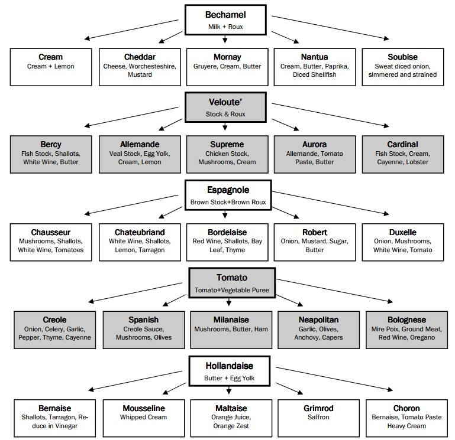

# Sovsene

Hvorfor er billedet der ikke? Kaninen er der!

Den skal laves til noget egen grafik.

## bærnæse

## De andre sovse

### steaksovs:

1/4	cup sennepspulver, Colmans - det er så også den eneste jeg normal kan finde
2	spsk varmt vand
2	spsk risvins eddike - vi prøver nok også med hvidvinseddike
1/4	cup soyasovs

Bland sennepspulver med vandet, og lad det sætte sig et par minutter.

Tilsæt eddike og soyasovs, bland, og passer gennem finmasket si.

Bum. Den skulle blive bedre hvis den får lov at stå på køl mindst en time.

Går også godt med andet - eg fisk.

### cherry tomat sovs

Fra Noma. Hvor de kalder den for "Faster than you can boil pasta cherry tomato sauce"

* 30 ml oliven olie
* 2 fed hvidløg
* 200 gram søde cherry tomater
* 1½ spsk "wild rose vinegar". 

Skær hvidløgene tyndt, tilføj dem til kold pande, med olivenolien.
Medium varme til de begynder at karamelisere.
Tilsæt de hele tomater, med et generøst drys salt. Låg på.

5-6 minutter senere er tomaterne sprængt og meget bløde. Stavblend til du kan lide konsistensen. Tilføj 
eddike (mon ikke vi skal prøve med balsamico), og smag til med mere eddike, salt og peber.

Foldes ind i kogt pasta, og serveres med et drys parmasan ost, et par dråber olie og evt et frisk basilikumblad.

Serveres med 200-300 gram pasta (altså før det koges)

### Pebersovs

Der skal udvikles yderligere. 
Den foreskrev oprindeligt 50 gram peberkorn. Og det var for meget.

2 små skaloteløg
olivenolie
25 gram syltede grønne peberkorn
2 teskeer sennep
7 dl okseboullion
1 sjat whiskey (prøv evt cognac i tstedet)
1 dl fløde
100 gram smør

skalotteløg hakkes og klares i olie.
Peberkorn (knus ca 1/4 af dem med en ske) skylles og tilsættes
sammen med boullion og sennep. Koges ind til ca. det halve.

tilsæt whiskey og fløde - kog et minuts tid ekstra.

Monter med smør, smag til med salt, sukker og peber.

Med 50 gram peberkorn, hvor intet blev mast, skulle der 
2 dl fløde til, og den var stadig ret heftig.

### BALSAMICO SOVS

2 spsk rørsukker
2 spsk balsamico eddike
1½ dl kalve eller kyllingefond
2½ dl piskefløde
Salt, peber, lidt maizenajævner
Smelt sukkeret, rør eddiken i. Rør fonden i til sukkeret er opløst. Rør piskefløden i, kog igennem. Juster tykkelsen med lidt maizena, og smag til med salt og peber.
